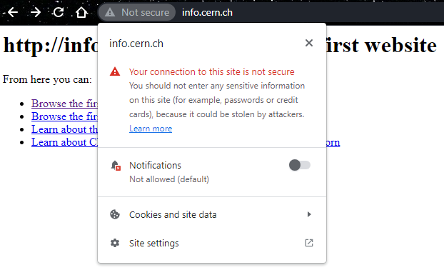
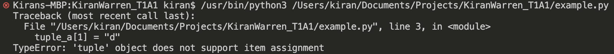

# Project - Workbook (Term 1)

### Kiran Warren

## Question 1 - Identify and explain common and important components and concepts of web development markup languages.

Markup is used to annotate text within a document. Markup could be as simple as using a highlighter while researching signify that highlighted sections of the text are important. When the rules used for markup become codified, it then becomes a markup language.

In the context of web development, markup languages may refer to XML (extensible markup language), HTML (hypertext markup language) or XHTML (extended hypertext markup language.) These three languages are based on SGML (standard generalized markup language), which is a language used for defining markup languages.

HTML is now the primary language used for web development, and all modern websites will contain some form of HTML. It was first released back in 1991, and was created by the inventor of the World Wide Web, Tim Berners-Lee. Since then, multiple versions of HTML have been released. The current version is HTML5, which provides the most flexible rules compared to other markup languages. HTML5 also allows any future additions or changes to be added to the language without the need for a new superseding version to be released.

As HTML was developed, the language became too complicated and there was a need for the web page content to be separated from the web page styling. While styling can still be described within the HTML document, the CSS (cascading style sheets) document was created to contain the web page styling.

Documents created in web development markup languages are used to instruct the web browser how the content within the document is displayed or printed. It does this by labelling contents within opening and closing tags. Tags are indicated using angle brackets (< and >) For example:

```HTML
<label>Web page content</label>
```

Labels can be nested within each other to label the content with multiple tags. For example, a section of text that we wanted to communicate to the browser was both paragraph text and bold font weight:

```HTML
<p><b>This text is bold paragraph text!</b><p>
```

HTML allows some flexibility with how tags are used. For example, in the bold paragraph text, even though the bold tag is nested within the paragraph tag, we are still able to close the paragraph tag first without confusing the web browser. This kind of flexibility is not allowed in more stricter markup languages:

```HTML
<p><b>This text is bold paragraph text!</p><b>
```

HTML documents have a basic structure consisting of 4 main elements:

- Document type declaraction - This is the first line of code of a html document, and declares what type of document it is.
- html tag - This tag contains all of the document contents (except for the doctype declaration), and communicates to the web browser that all information contained within the open and close tag is HTML-coded content.
- head tag - This tag contains meta information that is not viewable on the web page itself but can give the browser more information about the document.
- body tag - This tag contains all of the visible content of the webpage.

An example of the HTML document structure is as follows:

```
<!DOCTYPE HTML>
<html>
    <head>
        <title>Example Document</title>
    </head>

    <body>
        <h1>A Heading</h1>
        <p>Some paragraph text</p>
    </body>
</html>

```

In the example above, indentations are used to help the coder or whoever may be viewing the HTML code, to visually see the heirachy of the HTML tags. The html tag is the overarching label for the document, so all of the elements nested within it are indented. Similarly, the title is an element nested within the head, and therefore is indented to show this. The indentations are purely for the readability of the document, and does not affect how the web browser interprets the information.

As previously described, the head element contains meta information that is not viewed on the web page. Some of the elements that may be nested within the head tag include:

- title - The document title is a required element that must be present for the web page to be displayed correctly. It will be seen in the web browser tab and in search engine results.
- link - The link tag is used to reference an external document or asset. A common usage is to link a CSS document to the HTML document, so that the style described within the CSS document is applied to the web page. The link tag may also reference an image to be used as the favicon (displayed next to the document title in the web browser tab) or reference a font family that will be used in the webpage.
- meta - The meta tag is used to contain any metadata for the webpage. This may include webpage author, search engine keywords, a decsription of the document, the viewport to be used, etc. The viewport is an important piece of metadata to include, as this will assist the web browser in displaying the web page appropriately on different devices (e.g. PC, tablet, mobile phone).

After the head section will be the body section, which contains all of the content that is displayed on the webpage. As this is the content that the user will be viewing and interacting with, it will be the majority of the HTML code in most cases. Some of the common body elements used include:

- Text Elements
  - headings - Headings within the content are marked up with heading tags, h1 - h6, with h1 being the largest heading by default and h6 the smallest.
  - paragraphs - Paragraphs are marked up with p tags.
  - quotes - Quoted pieces of text can be tagged with q tags.
- Images - Images are linked in the document by using the img tag. An img tag will include a source attribute (src) that will contain the URL and an alternate text attribute (alt) that will be displayed if the image cannot be retrieved. Image tags do not have closing tags.
- Hyperlinks - Links or anchor tags (a) are used to transform a piece of content into a clickable hyperlink that will navigate the web browser to the designated location when pressed. The a tag will have a hyperlink reference attribute (href) that gives the URL of the hyperlink.
- Lists - HTML allows ordered and unordered lists with the ol and ul tags. Individual list items are nested within the ol/ul tags by using li tags.
- Forms - HTML forms are a way for the user to input information into the webpage that can then be collected. There are two main types of form elements:

  - input - An input element is the piece of content that the user interacts with in various ways depending on the input type attribute that is designated. These may include text fields, radio buttons, checkboxes, submit form buttons, etc.
  - label - The label tag will be associated to a specific input element or elements within a form. The label tag gives meaning to what the related input tag requires or describes. The for attribute of the label tag should be equal to the id attribute of the element or elements that it is describing.

When configuring how the HTML is to be displayed, the use of the style attribute is employed. Styling has a vast number of properties that change the way any element within the body is displayed. Some properties include its color, size, shape, how and where its placed on the page, animations, etc. An example of how it is employed within the HTML document is shown below:

```html
<p>This paragraph text is the default colour of black.</p>
<p style="color:red;">This paragraph text has been styled as red.</p>
```

Depending on the complexity of the page, the styling may be the majority of the webpage coding. This brought about the need for the styling to be separated from the HTML document. A separate type of document is created (CSS), which is then linked in the HTML document header.

With most of the styling removed from the HTML document, there may come a need to apply different styling properties to the same HTML tag types. Like the example above, maybe one paragraph element needs to have red text, while all the others remain default. To give greater granularity to the application of markup in the HTML document, the use of IDs and classes can be used.

- id - One element on a webpage may be given a unique id property. This allows for the styling of that id to override any overlapping styling given to that element tag. The id tag can also be used as a bookmark on a webpage. For example, a webpage may have a contents list near the top of the content to outline was is contained on the page. Each section listed in the contents can be given a unique id. We can then use anchors tags in the contents list to navigate to any of the sections by adding the #id to the end of the hyperlink reference.
- class - Multiple elements on a webpage may be given a class property. This makes it much easier to apply the desired styling properties to all of the specific HTML elements that require it.

HTML has some semantic elements that give greater meaning to what is contained within the tags. An exmaple of a semantic element would be the nav tag. A section of the webpage containing a list of navigation links can be contained within the nav tags to describe to the web browser and other developers what the purpose of that element is. A non-semantic alternative would be to have the list of navigation links within a span element, which does not describe the purpose of that particular section.

### References

- https://www.thoughtco.com/what-are-markup-languages-3468655
- https://www.w3schools.com/html/html_intro.asp
- https://www.youtube.com/watch?v=RH0o-QjnwDg
- https://www.w3.org/TR/WD-html40-970708/intro/sgmltut.html
- https://www.youtube.com/watch?v=Q4dYwEyjZcY\
- https://www.engr.colostate.edu/ets/html-structure/#:~:text=Within%20a%20web%20page%2C%20some,within%20the%20tags.
- https://www.w3schools.com/html/html_head.asp
- https://www.w3schools.com/tags/tag_meta.asp

## Question 2 - Define the features of the following technologies that are essential in terms of the development of the internet:

## - Packets

All data transmitted over the internet is broken up into smaller pieces called "packets". The internet is a "packet-switched" network, meaning it is designed for the transmission of packets across multiple routes from the source to the destination.

Paul Baran and Donald Davies are attributed with inventing the concept of packet switching networks in the 1960s. Paul Baran first created the concept while researching survivable network communications systems for the US Airforce. A survivable network needed to maintain end-to-end communications between two devices after destruction of network equipment within the network. Davies later arrived at the same concept a few years later, independently of Baran. The term "packet switching" was taken from Davies work, as it was more intuitive than Baran's term for the same concept, "distributed adaptive message block switching."

As an example, an email may be sent from one device to a receiving device. The email will be broken up into fixed-size chunks of data, i.e. packets, by the sending device. The packets are then sent across the internet to the destination using the best available route. The receiving device is then responsible for interpreting the packets and reforming them back into the original email. Each packet will contain the following, as dictated by the IP (internet protocol):

- Header - Information about the packet, including the source address and the destination address.
- Payload - The chunk of data that is being transmitted.
- Trailer - Similar to the header, the trailer also contains information about the packet. However, trailers are only used by some network types.

The use of packets means that there does not need to be a dedicated line of transmission between a source and a destination. The packets will take the best available route across the network to reach their destination. A single router/switch within the network is able to process packets from different devices independently of each other. In contrast, if packets were not used, then only one device could use a path to the destination at a time until the whole piece of data was transmitted, and all other computers on the network would have to wait their turn. This is beyond impractical for a network on the scale of the internet.

### References -

- https://computer.howstuffworks.com/question525.htm
- https://www.techtarget.com/searchnetworking/definition/packet
- https://www.youtube.com/watch?v=ewrBalT_eBM
- https://www.cloudflare.com/en-gb/learning/network-layer/what-is-a-packet/
- https://www.youtube.com/watch?v=3QhU9jd03a0&list=PL8dPuuaLjXtNlUrzyH5r6jN9ulIgZBpdo&index=29
- https://www.livinginternet.com/i/iw_packet_inv.htm#:~:text=The%20packet%20switching%20concept%20was,world's%20first%20packet%20switching%20network.

## - IP addresses (IPv4 and IPv6)

The IP (internet protocol) address is a unique identifier given to a device that is connected to the internet or a local network. The device is also called a host, which could be a computer, printer, etc. Data packets sent across the network will be given a destination address in the form of an IP address in the packet header, which tells network equipment the location of the destination device. IP addresses form the basis of the internet, and allow two devices across different networks to communicate with each other.

An IPv4 address is represented by four 8-bit (0 - 255) numbers, separated by periods (example: 127.0.0.1). The first three numbers of the IP address are the network ID and the last number is the host ID. The 32-bit IPv4 address offers a total of approximately 4.3 billion unique addresses (2<sup>32</sup>). This amount likely seemed sufficient when the IPv4 address was first launched in 1983, however, the ubiquity of the internet and the sheer number of devices that are now connected presents a real possibility of running out of unique addresses.

An IPv6 address is represented by eight hexadecimal (a - f, 0 - 9) 16-bit alphanumerics, separated by colons (example: 4000:0000:0000:0000:1be5:3020:a00e:2001). This address format provides an astronomical 340 undecillion unique addresses (2<sup>128</sup> or 3.4 x 10<sup>38</sup>). IPv6 also provides some additional technical differences to IPv4, including larger packet headers than IPv4 addresses (approximately double the size) and the elimination of NAT (network address translation).

### References

- https://www.kaspersky.com/resource-center/definitions/what-is-an-ip-address
- https://learn.microsoft.com/en-us/troubleshoot/windows-client/networking/tcpip-addressing-and-subnetting
- https://computer.howstuffworks.com/internet/basics/what-is-an-ip-address.htm
- https://kinsta.com/blog/ipv4-vs-ipv6/#:~:text=What%20Is%20the%20Difference%20Between,least%20for%20the%20foreseeable%20future).
- https://www.menandmice.com/blog/ipv6-reference-address-space
- https://www.usg.edu/galileo/skills/unit07/internet07_02.phtml
- https://www.internetsociety.org/internet/history-internet/brief-history-internet/

## - Routers and routing

Routers are a network device that are responsible for receiving packets from a device and forwarding it towards the destination device using the most efficient path. The router is the traffic controller for packets, directing them to where they need to go whilst avoiding congestion. Routers connect networks together, forwarding data packets between them. Communication of two devices on different networks across the internet is managed by a series of routers. Routers are the physical infrastructure that facilitate communication across the countless networks that make up the internet.

Routing is performed by the router by reading the header information of a data packet to see where the destination device is. The router will consult its routing table to determine the most efficient pathway for the packet to take to reach its destination. Information within the routers routing table can be manually configured or learning by dynamic routing protocols. Congestion can occur over the network intermittently at different locations, so it is the routers job to balance the load across various connections to ensure efficient delivery of data.

### References

- https://www.cloudflare.com/en-gb/learning/network-layer/what-is-a-router/
- https://en.wikipedia.org/wiki/IP_routing
- https://en.wikipedia.org/wiki/Routing

## - Domains and DNS

Computer networks use IP addresses to send data packets from one device to the other. While this is perfectly fine for computers to communication, it becomes hard for humans to interpret and remember specific addresses. Domain names provide a readable and meaningful address for websites that are much easier for people to use. The domain name system was created in 1983 by Paul Mockapetris and his team to replace the manual and increasingly-complex process of manually assigning IP addresses and storing them for reference in a .txt file on an NIC server.

A domain name can contain several strings, separated by periods. Each string can denote information about that domain. For example:

> https://coderacademy.edu.au

This is the homepage for Coder Academy's website, which is clearly evident by reading the domain name. The last string "au" is called the top-level domain and is assigned to the domain name by the domain name authority in Australia. The "edu" string is called the second level domain in this instance, and refers to schools and educational institutions.

When a domain name is entered into a web browser, the web browser will need to then resolve the domain name into an IP address that can be used by networking devices. It does this through the use of the DNS (domain name system). The web browser will send off a request to a DNS server, requesting the IP address for the domain name that was entered. If the domain name could not be matched in the server, the request will be forwarded onto another DNS server to be resolved. If the domain name cannot be found, the web browser will return an error (example: ERR_NAME_NOT_RESOLVED).

### References

- https://computer.howstuffworks.com/dns.htm
- https://www.cloudns.net/blog/dns-history-creation-first/

## Questions 3 - Define the features of the following technologies that are essential in terms of the development of the internet:

## - TCP

TCP stands for transmission control protocol, and is a transport layer protocol that works in conjunction with the internet protocol to ensure that data packets are received without error and in the correct order. The IP ensures that each packet of a given piece of data arrives at the required destination, and the TCP ensures that those packets are assembled into the right order and have not been corrupted. The TCP information (TCP header) is contained within the payload of the packet.

While IP is a connectionless protocol only concerned with each packet being routed to the destination, TCP maintains a connection between a client and a server for the transmission of the data. TCP has contributed to client-server communication by improving the reliability of data transmission and making corrections when data packets have been lost or corrupted.

Reusing the email example, an email is sent from a client computer to a receiving server:

- The source device will send an initial request (SYN or synchronisation) packet to the server.
- Upon receiving the request, the server will send back a packet to agree to the process (SYN/ACK or synchronisation/acknowledgement).
- Upon receiving the SYN/ACK packet, the source device will then send back another packet to confirm the process (ACK or acknowledgement).
- The email is then broken up into packets and sent over the network. Each packet requiring an ACK from the server to confirm that the packet was received and without error. A packet may be re-sent if no ACK was received or if the checksum within the TCP header received by the server notified that the packet payload was corrupted.
- The rate at which packets and acknowledgements are sent is controlled by TCP flow control. The device sending the data packets will adjust the rate of transmission based on the receiving device's receive window.
- The server will reassemble the packets back into the original email using the TCP implementation.

### References

- https://www.cloudflare.com/en-gb/learning/ddos/glossary/tcp-ip/
- https://www.youtube.com/watch?v=AEaKrq3SpW8&list=PLH2l6uzC4UEW0s7-KewFLBC1D0l6XRfye&index=30
- https://tp4348.medium.com/what-happens-when-you-visit-a-website-1fd12cc241dc

## - HTTP and HTTPS

HTTP, or hypertext transfer protocol, is an application layer protocol designed for the transmission of data between web browsers and servers. It is a client-server protocol, with the client sending requests to the server, and the server sending back responses.

An example of an application that uses this protocol is a web browser. The web browser knows what protocol to use based on the first piece of the URL:

> <b>https</b>://coderacademy.edu.au

This piece of the URL will tell the browser to use the "https" protocol to retrieve the media from the web server(s). Upon entering a URL or clicking on a link, the web browser will send HTTP GET requests to the corresponding web servers for the content on the webpage. The server will then in turn send back the HTTP response, which will contain the media that was requested. The web browser can also send information to server using a HTML POST request, for example, when a HTML form is filled out and submitted.

For HTTP requests and responses, all of this information is sent between the client and server as plain text. Any third party monitoring the connection can easily read the information that is being communicated. This transparency raises issues when dealing with any information that may be sensitive, such as user login details, HTML form submissions, banking information, etc.

The HTTPS protocol was developed to create a secure connection between the client and server. The added "S" in HTTPS stands for secure. All information sent between the web browser and the server is encrypted using SSL/TLS (secure sockets layer/transport layer security) encryption. Additionally, servers require SSL certificates to give client's verification that they are communicating with the server that owns the requested domain. Web browsers now give warnings when attempting to communicate with a server using HTTP instead of HTTPS:



### References

- https://developer.mozilla.org/en-US/docs/Web/HTTP
- https://www.cloudflare.com/en-gb/learning/ssl/why-is-http-not-secure/
- https://www.cloudflare.com/en-gb/learning/ssl/what-is-an-ssl-certificate/

## - Web browsers (requests, rendering and developer tools)

On a basic level, web browsers are applications used to surf the world wide web. They handle all of the HTTP communication with servers, and renders the retrieved files into viewable content for the user.

To reuse a similar example, when a URL is entered into a browser:

- The browser will read the first piece of the URL (e.g. https://) to know what protocol to use to communicate with the server.
- The browser will resolve the human-readable URL into an IPv4 or IPv6 address, by requesting the corresponding IP address from DNS servers.
- The browser will establish a TCP connection with the server at the requested address.
- The browser will then make one or more HTTP GET requests to the server to retrieve the file(s) at the requested URL.
- The server will respond by sending back the requested files.
- The browser will render the files (HTML, CSS, etc.) into viewable content for the user in the application window.

There are other HTTP requests that a browser may send to a server, such as a POST request. A POST request will be used when a user fills out a HTML form on a web page and presses the submit button. The data submitted by the user will be sent to the server, which may then create or update a resource. The server will then respond back to the client with whether the POST request was accepted or rejected.

The browser renders the retrieved files into viewable content for the user through a process called the critical rendering path (CRP):

1. Document Object Model (DOM) - The HTML elements are read by the browser, they will be converted to JavaScript objects. A DOM tree is constructed using the heirachy set forth by the HTML code structure.
2. CSS Object Model (CSSOM) - The styling information will be read by the browser and converted into another tree, similar to the DOM.
3. Render Tree - The DOM and CSSOM are combined to create a render tree, which contains all of the objects that will be visible and how they will be styled.
4. Layout - Each object on the render tree has its layout created based on its individual size, where it is in relation to other objects, and the viewport it will be presented on.
5. Paint - Objects are layered about the z-axis (i.e. CSS z-index property). Pixels are then painted within the browser window. Pixels may require re-painting when certain actions occur, such as scrolling.

Modern web browsers include a set of developer tools, that can be used for useful tasks such as checking the performance of a webpag, inspecting the contents of the HTML, seeing what CSS properties are applied to HTML elements, etc.

Web browsers have been instrumental to the development of client and server communication by handling all of the technical requirements such as HTTP requests, rendering of HTML and CSS files and allowing the user to seamlessly interact with the web page. They also aid web developers by providing developer tools that help when constructing, debugging and analysing the performance of web pages.

### References

- https://www.mozilla.org/en-US/firefox/browsers/what-is-a-browser/
- https://www.techopedia.com/definition/288/web-browser
- https://www.geeksforgeeks.org/web-browser/
- https://developer.mozilla.org/en-US/docs/Web/HTTP/Methods
- https://www.codecademy.com/article/http-requests
- https://reqbin.com/req/zvtstmpb/post-request-example
- https://developer.mozilla.org/en-US/docs/Web/Performance/Critical_rendering_path
- https://medium.com/jspoint/how-the-browser-renders-a-web-page-dom-cssom-and-rendering-df10531c9969
- https://developer.mozilla.org/en-US/docs/Learn/Common_questions/Tools_and_setup/What_are_browser_developer_tools

## Question 4 - Identify three data structures used in the Python programming language and explain the reasons for using each.

There are four data structures used in Python: lists, tuples, sets and dictionaries. These data structures can be collections of individual data types of any kind, or collections of other data structures, or a combination of both.

Data structures in Python do not need to be homogeneous, meaning that any data structure can contain a mix of different data types without issue. However, some functions may require compatible data types in order to run without error. An example of this may be using the sum() function on a list that contains strings and integers called 'list'. Trying to compute sum(list) will return an error as strings and integers cannot be added together in Python.

Three of the four data structures are:

### Lists

These are the most commonly used data structure in Python. They are mutable, meaning that items within the list can be changed, removed and added. Lists are also sequenced, meaning that the items within the list are of a particular order and will have a corresponding index. A list can be created using square brackets or the list function:

```python
list_a = [0, 5, "hello"]
list_b = list("have a good day", 0.00057, 99)
```

Lists should be used when the data set contained in the list needs to be mutable and sequenced. If we have a data structure that will have its items added, changed or removed, and the order of these items is important, then a list would be an appropriate choice.

### Tuples

Tuples are almost identical to lists, except that tuples are immutable. Once a tuple has been created, the items within it cannot be added, changed or removed. Below is the error received when trying to re-assign a tuple item.



The only technical exception to this would be if a mutable data structure, such as a list, was stored within a tuple. The items within the stored data structure may be altered, but the tuple itself cannot be changed. A tuple can be created using the round brackets, comma-separated items or the tuple function using a list as an argument:

```python
tuple_a = ([0, 1], "abc", 19, 19.00002)
tuple_b = 1, 4, 9
tuple_c = tuple(list_a)
```

When items within a data structure should not be changed after creation, then a tuple should be used. It will prevent accidental altering, adding or removed of items. The tuple is also a more memory-efficient than a list.

### Dictionaries

Dictionaries are a mutable data structure that contain key:value pairs. In lists, we can refer to items based on their index. In dictionaries, we can refer to values based on their key. A dictionary can be created using curly braces with colon separated key and value pairs or using the dict() function:

```python
dict_a = {'key_1':'value_1','age':33,'height':193}
dict_b = dict(first_name="kiran",birth_year=1989)
```

The keys, values or both can be returned using the following methods:

```python
dict_a.keys() # Returns the keys from dict_a
dict_a.values() # Returns the values from dict_a
dict_a.items() # Returns the ('key', value) pairs from dict_a
```

Dictionaries are very similar to lists, however, their items are referred to by the use of their associated key instead of their index. This means that while dictionary items are technically ordered (as of Python 3.7), their order does not matter when accessing values. The values within the dictionary are also given more meaning with the key as a description, which improves the code readability for programmers.

### References

- https://www.youtube.com/watch?v=R-HLU9Fl5ug
- https://www.w3schools.com/python/python_dictionaries.asp#:~:text=A%20dictionary%20is%20a%20collection,version%203.7%2C%20dictionaries%20are%20ordered.

## Question 5 - Describe the features of interpreters and compilers and how they are different.

Code written in high level programming languages, such as Python or C#, are not readily understandable by computers. Computers require instructions given in binary, which is also called machine code. An intermediate step is required between an operation written in high level language and the computer performing that operation. This intermediate step is performed by compilers and interpreters.

### Interpreter

The interpreter will read, convert and execute the code line-by-line. If there is an error within the code, the code will run up to that point then break and display the error. Python is an example of a high level language that uses an interpreter.

### Compiler

The compiler reads and converts all of the code first. If an error is within the code, it will result in a compiler error and none of the code will execute. C# is an example of a high level language that uses a compiler.

Some differences between the interpreter and compiler include:

- Speed - The compiler will take longer before code execution begins, due to it having to convert the entire code to machine code first. However, execution of the code will be slower with an interpreter due to each line having to be read and converted to machine code as execution is occurring.
- Errors - A compiler will not execute code that contains an error. The interpreter will run the code up until the point at which an error occurs.
- Ease of development - A compiled code will run faster, however, when developing and debugging code, an interpreter is more developer-friendly.
- Output of the Compiler/Interpreter - A compiler will create an executable file from the compiled code, which can be stored and run later without the need of the source code. The interpreter does not have a similar output, and requires the source code in order to be executed again.

### References

- https://www.geeksforgeeks.org/difference-between-compiler-and-interpreter/
- https://www.youtube.com/watch?v=3iLUls6Z_tw

## Question 6 - Identify two commonly used programming languages and explain the benefits and drawbacks of each.

The two programming languages will be Python and C:

### Python

Python is a high level language, created for general use programming. Python is an extremely popular programming language, given that it has diverse applications and has a very readable syntax. Some benefits of the Python programming language include:

- Open source - Anyone is free to access the source code for Python and modify and share it.
- Diverse applications - Python has a extensive number of libraries than can be imported and used.
- Excellent readability - The syntax of Python is very easy to understand and learn. Indents are used to define code blocks.
- Interpreted code - Python uses a code interpreter instead of a compiler. This makes it an easier language to develop and debug.
- Dynamically-typed - Python uses dynamic-typing, which means that variable types are decided during execution of the code. This makes the language more flexible and simpler when developing the code.
- Portability - Python can be run on any platform without the need for code to be changed to suit.
- Exception handling - Exceptions can be handled in run time with the use of try/except statements.

Some drawbacks to using Python include:

- Interpreted code - While this does have benefits with development, it also creates inefficiencies when executing code. Other languages would be preferred if execution speed is important.
- Dynamically-typed - This also provides benefits with development, but comes with drawbacks. Execution will be slower due to the typing happening at execution. More errors can be created when running the code due to variables having unexpected data types or data types changing due to re-assignment.
- Memory usage - Due to the all the features Python provides, this comes with the downside of taking up memory space.

### C

C is a general purpose language and considered to be a middle level language with both high level and low level uses. C forms the basis for many other programming languages and was developed in 1972 from a programming language called B. Some benefits of using the C programming language include:

- Simplicity - Limited number of keywords or symbols to learn mean it is a simple language to learn.
- Diverse application - C can be implemented as a high level language for applications or a low level language for hardware drivers.
- Compiled code - C is a compiled code, and has an incredibly fast execution speed.
- Portability - C is based on ascii characters, and can therefore work on any platform.

Some drawbacks of using C include:

- Hardware management - Some hardware resources need to be managed, for example, memory allocation.
- No object orientation - C does not support object orientated programming. For example, unlike Python, methods cannot be inherited from parent classes. Constuctors cannot be used to create objects.
- No namespace - Variable and function names cannot be reused in different contexts.
- No exception handling - Special cases cannot be handled during run time.

### References

- https://www.youtube.com/watch?v=rd6SgAIvGjw
- https://www.youtube.com/watch?v=2lVDktWK-pc
- https://thecodest.co/blog/pros-and-cons-of-python/
- https://medium.com/@saadbenaicha/python-12-advantages-and-disadvantages-41bc407cf965
- https://www.youtube.com/watch?v=No-6xCBWdT8
- https://data-flair.training/blogs/advantages-and-disadvantages-of-c/
- https://www.includehelp.com/c/advantages-and-disadvantages-of-c-programming-language.aspx
- https://unstop.com/blog/advantages-and-disadvantages-of-c-programming-language

## Question 7 (i) - Identify two ethical issues from the areas below and discuss the extent to which an IT professional is ethically responsible in terms of the issue.

## Question 7 (ii) - For each ethical issue, identify a source of legal information relating to the ethical issue and discuss whether the law is helpful in assisting a developer to act in an ethical way.

### Access to a user's personal information (medical, family, financial, personal attributes such as sexuality, religion or beliefs)

- IT professionals must read and understand the privacy policy that is given to users. They must also understand how it applies to the way in which they handle user's data.
- IT professionals must know who the key privacy officer is at their workplace, and understand their responsibilities. Any potential privacy issues that an IT professional encounters should be raised with the privacy officer or someone senior.
- IT professionals must consider privacy during the planning stage of the project, for example, conducting privacy impact assessments.
- IT professionals should only collect personal information that is actually required, and not because it may be useful sometime in the future.
- IT professionals should only access user's personal information on a need-to-know basis.
- IT professionals must take care when handling sensitive information, which is given a higher level of protection under the Privacy Act 1988. Sensitive information may be a user's religious beliefs, sexual orientation, genetic information, etc.
- IT professionals must take reasonable steps to ensure that personal information is protected from unauthorised access.

The Privacy Act 1988 describes how entities should handle personal information in a responsible way. This is an extensive legal document, and likely more appropriate for the legal department than the IT department.

The Australian Government, Office of the Australian Information Commissioner, provides a privacy guide for organisations and government agencies which is derived from the Privacy Act 1988, but presented in a more easy-to-understand manner. This would be a good resource for a developer to consult before they take a role that involves handling user's personal information.

### Intellectual property, copyright and acknowledgement

- IT professionals should respect intellectual property rights. IP should not be used unless permission is given by the IP owner, and acknowledgement must be given when used.
- IT professionals must comply with copyright law. An IT professional may encounter software, music, images, text, etc. that has been copyrighted. The copyrighted work should not be used, unless permission is given by the copyright holder. Copyright protection
- IT professionals should give full attribution when others work has been used. Open source software and creative commons content typically requests that attribution be given to the original author/creator.

## Question 7 (iii) - Conduct research into a case study of one of the ethical issues you have chosen and discuss how an ethical IT professional should respond to the case study and how they might mitigate or prevent ethical breaches.

ghfhgffh

### References

- https://www.oaic.gov.au/privacy/privacy-guidance-for-organisations-and-government-agencies/handling-personal-information/protecting-customers-personal-information
- https://www.legislation.gov.au/Details/C2014C00076
- https://www.gtlaw.com.au/knowledge/doing-business-australia/guide-intellectual-property-australia
- https://www.legislation.gov.au/Details/C2022C00192

## Question 8 - Explain control flow, using examples the Python programming language.

Control flow is the way in which the order of execution is controlled in a programming language. By default, programming languages will run sequentially, meaning that the code will run in the order that they appear. For example:

```python
x = 1
y = 2
z = x * y
print(z) # Will print 2 in console
```

The code in the above excerpt runs from top to bottom as one would logically expect. There are many ways to change the order of execution of the code by using control flow such as conditional statements, repetition statements and transfer statements.

### Conditional Statements

The if statement will let a block of code run only if its condition is TRUE. The simplest of if statements can just contain one condition, that if TRUE, will cause the code within the if block to execute:

```python
guess = int(input("Guess a number between 1 and 10: "))

if guess == 7:
    print("You guessed right!")
```

If the number 7 was entered, then "You guessed right!" will print in the console. Otherwise, no further action will occur.

More complex if statements can be created using if-elif-else statements. A more detailed version of the above example would be:

```python
guess = int(input("Guess a number between 1 and 10: "))

if guess < 1 or guess > 10:
    print("The number entered was not between 1 and 10!")
elif guess == 7:
    print("You guessed right!")
else:
    print("Sorry, better luck next time!")

```

In the above example, there are three conditions presented within the if-elif-else statement, and only one of the code blocks will run based on what number the user enters.

### Loops or Repetition Statements

Loops are a repetition statement that will execute a code block a repeated number of times depending on the type of loop used. Loops can be executed a fixed number of times (for loops) or will execute a loop while a condition is TRUE (while loops).

The below example will store individual characters from a string into a list. The for loop is used to iterate over the length of the string. The for loop is used in this instance because we know exactly how many times the code block needs to be executed in order to store the entire string, i.e. len(str).

```python
str = "hello"
str_list = []

for i in range(len(str)):
    str_list.append(str[i])
```

The while loop is used when the number of iterations may not be known, but rather the code block needs to be run until a certain condition is met. The condition will be checked before each time the code block runs.

```python
guess = 1

while guess != 7:
    guess = int(input("Guess a number between 1 and 10: "))
```

In the above example, the code block will keep executing until the user correctly guesses the number 7. It is not known how many guesses it will take the user to guess the number 7, so the repetition statement needs to be run based on their input instead of a fixed number of times.

Given that while loops repeat based on a condition, there exists the possibility for the code to get stuck in the while loop and never satisfy the condition. This is called an infinite loops. Below shows an example of this:

```python
guess = 1
correct_guess = False

while correct_guess == False:
    guess = int(input("Guess a number between 1 and 10: "))
```

The condition will never be satisfied, because the variable in the while condition is never altered within the code block. Either the correct_guess variable needs to be updated within the code block when the user guesses correctly, or a break statement could be used to force the loop to end when a correct guess is entered.

### Transfer Statements

Transfer statements are control flow statements that are used within loops the change the loop's execution. The two transfer statements in Python are break and continue. Some sources include the pass statement within transfer statements, and others do not.

The break statement is used to force a loop to end. It can be used within a conditional statement to force a loop to end based on a condition being met.

```python
str = "hello my friend"
str_list = []

for i in range(len(str)):
  if str[i] == " ":
    break # End the for loop when a space is encountered
  str_list.append(str[i])
```

The above example will store each character from string 'str' into the list 'str_list'. The loop wants to iterate over the length of the 'str' string. However, in this case, we only want the first word in the string, so the break statement is used to force the loop to end when a space is encountered. The str_list list will be ['h', 'e', 'l', 'l', 'o'] after the loop ends due to the break.

The continue statement is used to skip the rest of the code within the loop at the current iteration, and move onto the next iteration. Reusing the previous example, the str_list can be built up with all non-space characters and spaces can be ignored:

```python
str = "hello my friend"
str_list = []

for i in range(len(str)):
  if str[i] == " ":
    continue # Go to the next iteration, i, upon encountering a space
  str_list.append(str[i])
```

The str_list list will be ['h', 'e', 'l', 'l', 'o', 'm', 'y', 'f', 'r', 'i', 'e', 'n', 'd'] after the loop has ended. The continue statement skipped the two spaces and did not let them get appended to the list.

The pass statement may also be considered a transfer statement. The pass statement is used as a placeholder when a code block is syntactically required, but there is no code that needs to be run.

### References

- d
- d

## Question 9 - Explain the difference between type coercion and type conversion. Are either of these used in Python?

Variables in Python will be given a data type based on the value that they are given. For example:

```python
a = 6 # int or integer data type
b = 6.1 # float or floating point number data type
```

Python uses dynamic typing (variable data type decided during execution), and will assign _a_ with the type 'int' and _b_ with the type 'float'.

The data type of one of these variables may want to be changed futher on in the code at some point, and for that, type conversion can be used. For example:

```python
a = 6
b = 6.1

a = float(a) # variable 'a' converted to float data type
```

Some operations on different data types cannot be performed, such as adding a string to an integer. In other programming languages, such as JavaScript, type coercion will occur and force a variable into a different data type in order for the operation to be performed. This is called type coercion and Python DOES NOT have type coercion.

```python
a = "hello"
b = 6

c = a + b
```

In Python, the above code will result in a type error as _a_ and _b_ are different data types. Python will want _b_ to be a string in order to perform the concatentation operation. In JavaScript, variable _c_ will result in "hello6" for a similar operation.

However, there are some interesting exceptions to this. For example:

```python
a = 6 # int
b = 6.1 # float

c = a + b # float
```

This code will run without error in Python, and it is NOT due to type coercion. What is occurring is that float and integer variables are objects with methods given by their class type. The integer add method does not know how to add a float value to itself, so Python attempts the reverse order and checks whether the float object's add method can add an integer to itself. In this case, the float's add method does know how to add an integer. The resulting value in variable _c_ will also be of float type.

```python
a = 6 # int
b = 6.1 # float

# c = a + b ----This operation will call the following methods:
c = a.__add__(b) # NotImplemented, so Python attempts addition in the reverse order:
c = b.__radd__(a) # This operation will be performed and 'c' will be a float type
```

To summarise, Python does use type conversion, but does NOT use type coercion.

### References

- d
- d

## Q10 - Explain data types, using examples.
